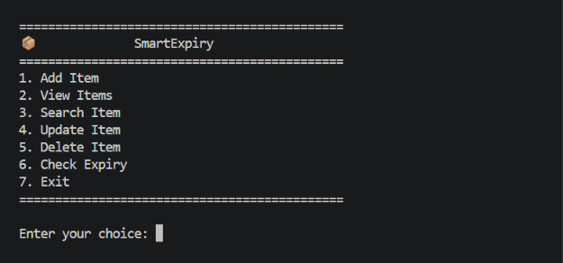

# 📦 SmartExpiry

> My first Python OOP project — built to solve a simple everyday problem.

SmartExpiry is a simple Python project I built while learning **Object Oriented Programming (OOP)**.

The idea came from a small everyday problem. We often forget expiry dates of medicines, groceries, or even important documents until it's too late. Instead of trying to remember everything, I wanted to build a simple application where all these items could be stored and managed in one place.

More than solving the problem itself, this project helped me understand how different OOP concepts work together in a real application.

# Why I Built This

While learning Python, I noticed that many beginner projects are things like student management systems or library management systems.

I wanted to build something a little different something that could actually solve a small real world problem.

At home, medicines expire without anyone noticing, groceries sometimes stay in the fridge longer than they should, and important documents like passports or insurance papers have renewal dates that are easy to forget.

So I decided to build **SmartExpiry**.

It became a great way to practice Object Oriented Programming while building something useful.


# Features

The current version of SmartExpiry allows you to:

- Add new items
- View all stored items
- Search items
- Update item details
- Delete items
- Check which items have expired
- Check which items are safe
- Save all data to a JSON file
- Automatically load saved data when the application starts

Everything runs through a simple command line menu.


# Supported Categories

At the moment, SmartExpiry supports three types of items:

- 💊 Medicine
- 🛒 Grocery
- 📄 Document

Each category stores its own information while still sharing common properties through inheritance.


# OOP Concepts Used

The main purpose of this project was to practice Object Oriented Programming.

While building SmartExpiry, I used concepts like:

- Classes and Objects
- Constructors (`__init__`)
- Instance Attributes
- Instance Methods
- Inheritance
- Method Overriding
- `super()`
- Encapsulation
- Polymorphism

Instead of learning these concepts only through examples, this project helped me understand how they work together in a real application.

# Project Structure

```text
SmartExpiry/
│
├── data/
│   └── inventory.json
│
├── models/
│   ├── item.py
│   ├── medicine.py
│   ├── grocery.py
│   └── document.py
│
├── services/
│   └── inventory.py
│
├── .gitignore
├── main.py
└── README.md
```

# How It Works

The application follows a simple flow.

```text
Start Program
      │
      ▼
Load inventory.json
      │
      ▼
Display Menu
      │
      ▼
User Chooses an Option
      │
      ▼
Perform the Operation
      │
      ▼
Save Changes
      │
      ▼
Exit
```
# Technologies Used

- Python
- Object-Oriented Programming (OOP)
- JSON
- File Handling
- Datetime Module
- OS Module

No external libraries are used in this project.

# Getting Started

### Clone the repository

```bash
git clone https://github.com/<your-username>/SmartExpiry.git
```

### Go to the project folder

```bash
cd SmartExpiry
```

### Run the application

```bash
python main.py
```


## 📸 Screenshots

### Main Menu

<p align="center">
  
</p>

### View Items

<p align="center">
  
</p>

### Add Item

<p align="center">
  
</p>

### Expiry Report

<p align="center">
  
</p>

# What I Learned

This project taught me much more than just writing Python classes.

Some of the things I learned while building SmartExpiry are:

- How to design classes for a real application
- When to use inheritance
- How method overriding works
- Working with JSON files
- Reading and writing files
- Organizing a Python project into multiple files
- Building a menu-driven application
- Thinking about code structure before writing code

This project gave me a much better understanding of Object Oriented Programming than practicing individual examples.


# Future Improvements

There are still many ideas I'd like to add in future versions.

Some of them are:

- Web version using Flask
- SQLite or MySQL database
- User login
- Email reminders
- Barcode scanner
- Dashboard
- Export to CSV/PDF
- Cloud backup
- Mobile application

For now, I wanted to keep the project focused on learning Python and OOP fundamentals.

# Contributing

If you have any suggestions or ideas to improve this project, feel free to open an issue or submit a pull request.

I'm always open to learning better ways of building software.

## License

This project is licensed under the MIT License. See the `LICENSE` file for more details.

# Final Thoughts

SmartExpiry started as a way to practice Object Oriented Programming, but along the way it became one of the projects that helped me understand how different programming concepts come together to build a complete application.

There are still many improvements I'd like to make, but I'm happy with this first version and excited to continue improving it as I learn more.

If you took the time to check out this project, thank you! 